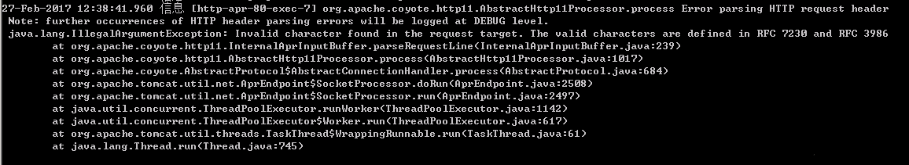

# Tomcat error The valid characters are defined in RFC 7230 and RFC 3986

今天下载了一个新的tomcat正常部署后，发现所有的api接口返回400错误。
很是疑惑。
代码都相同，只是换了tomcat的版本而已，待我细细看了tomcat 的log后发现了这个错误The valid characters are defined in RFC 7230 and RFC 3986

于是查了一番发现：
> 在tomcat 8.0.35版本之后，tomcat对url的参数做了规范限制，必须按照**RFC 7230 and RFC 3986**规范；对非保留字符，必须做转义处理，否则一律接口返回400，错误信息是The valid characters are defined in RFC 7230 and RFC 3986

解决办法有一下几个：
- 选用tomcat 8.0.35以前的版本
- 针对非保留字符做转义
- 尽量使用保留字符
- 直接将参数用urlencode一股脑编码下**（推荐）**

